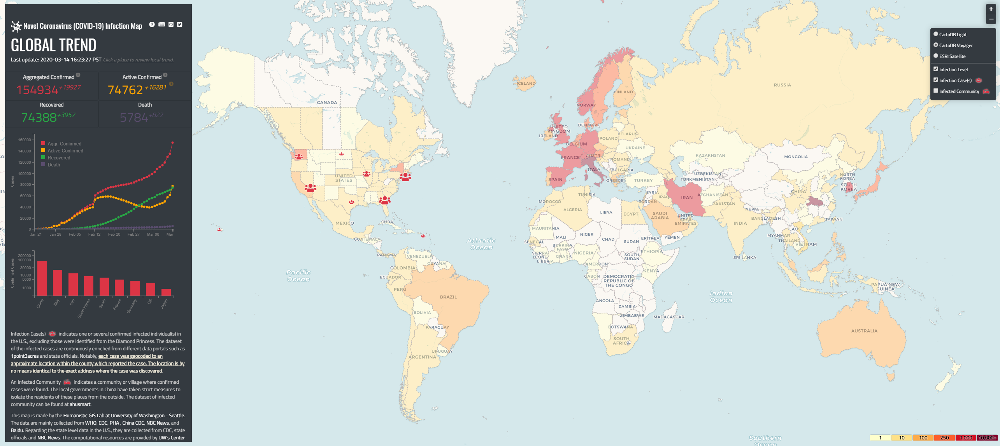

#  Noval Coronavirus Infection Map

This repository stores the source code for the Noval Coronavirus Infection Map (https://hgis.uw.edu/virus). This map is made by the [Humanistic GIS Lab](https://hgis.uw.edu) at [University of Washington – Seattle](https://www.uw.edu). This online internactive map enable users to track the spreading strend of Noval Coronavirus infection in a timely fashion since Jan 21st, 2020. The Coronavirus infection dataset is timely collected from multiple official sources and plotted to the map. A user can track either the global and local trend of the virus infection.

## Data Sources:
The data are mainly collected from a) [National Health Commission](http://en.nhc.gov.cn/) (NHC) of the People’s Republic of China; b) China’s Provincial & Municipal Health Commission; c) China’s Provincial & Municipal government database; d) Public data published from Hongkong, Macau and Taiwan official channels; e) [World Health Organization](https://www.who.int/emergencies/diseases/novel-coronavirus-2019/situation-reports/) (WHO), f) [Centers for Disease Control and Prevention](https://www.cdc.gov/coronavirus/) (CDC), g) [Public Health Agency of Canada](https://www.canada.ca/en/public-health.html) (PHA), h) [Baidu](https://voice.baidu.com/act/newpneumonia/newpneumonia).

- The dataset (in sqlite format) can be dowloaded from http://hgis.uw.edu/virus/assets/virus.db.

- You can view the data (in csv format) at http://hgis.uw.edu/virus/assets/virus.csv.

> **Note:** In the data table, each cell represents the infection status in the format of "#-#-#-#" -- a 4-sequel entry divided by dashes. The first sequel represents number of confirmed cases, the second sequel represents suspected cases, the third sequel represents cured cases, the fourth sequel represents death cases.

## 	Update Procedure:

The global data of the virus infection is collected from WHO, the China data is collected from multiple sources such as NHC, and Baidu. We also refer to CDC to verify the virus spreading in the U.S. To make timely updates of the map, we will collect the data every 4 hours, and verify the data quality per day. In addition, we plan to provide finer scale data from China (the county level), U.S. (the state level) and Canada (the province level) in the next version.

## Acknowledgement:

- Team members: Bo Zhao (leader), Fengyu Xu, Lola Kang, Joshua Ji, and Steven Bao.
- The Server is hosted at [UW's Center for Studies in Demography and Ecology](https://csde.washington.edu/) (CSDE).
